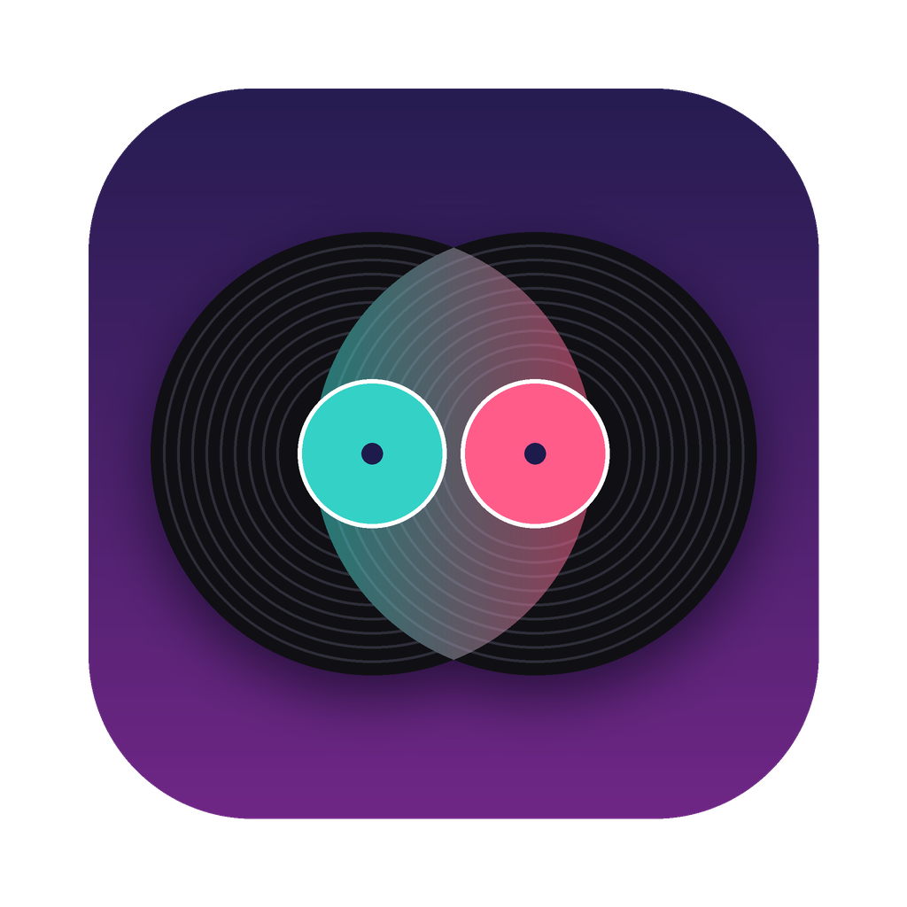

<p align="center"></p>

# MusicMerge

**Merge two or more iTunes or Music libraries into one clean library, with every song once, in the best copy you have.**

MusicMerge is a free, open-source Mac app that walks you through the merge one step at a time. It finds duplicates by their tags *and* by their sound, keeps the best-quality copy, optionally fixes tags and cover art from MusicBrainz, and brings your play counts, ratings, loved songs and playlists into a fresh Music library.

Your original libraries are never changed, and MusicMerge never deletes anything.

## The steps

1. **Choose your libraries** and a new, empty folder for the result. Put the library whose play history matters most first.
2. **Find duplicates.** Every song is read and compared. Nothing is changed. You get a plan you can open in any spreadsheet app, plus a short list of things worth a look.
3. **Build the merged library.** The best copy of every song goes into the new folder, sorted into Artist / Album folders. On a Mac, when the new folder is on the same drive, songs are *cloned*: instant, and they use almost no extra space.
4. **Clean up tags (optional).** Each album is looked up on [MusicBrainz](https://musicbrainz.org). Strong matches get corrected tags, cover art and tidy file names. Everything else keeps its own tags.
5. **Add it to Music.** The app shows exactly how to make a fresh Music library and import the merged folder, then checks that every song arrived.
6. **Bring back play history.** Play counts, ratings, loved songs, last-played dates and playlists go into the new library. You can check first; the check changes nothing.
7. **Clean up.** The app shows what you can delete, how much space that really frees, and lets you save any videos or PDFs that were sitting in the old folders.

Every step can be stopped and continued later, even after quitting. Choose *Continue an Earlier Merge* and pick the merged folder.

## How the best copy is chosen

Copies are the same song when they share album, title and artist (ignoring case, accents, punctuation, "The" and labels like "(Remastered)") and their lengths are within 3 seconds, or when their audio fingerprints match. Fingerprints also catch untagged copies such as *Track 01* in *Unknown Artist*.

The winner is, in order: lossless over compressed, not copy-protected over protected (.m4p), higher bitrate, more complete tags, the earlier library in your list, a name without iTunes' " 1" suffix, the larger file.

Anything doubtful is kept, not dropped: when the tags agree but the audio does not, both copies stay and the pair is listed for review. The same recording on two different albums (an album and a greatest-hits, say) stays on both.

## Download and first launch

Download the zip for your Mac from [Releases](https://github.com/CD-PLAYA/music-merge/releases): **x86_64** for Intel Macs, **arm64** for Apple Silicon. It needs macOS 13 Ventura or later.

The app is not signed with an Apple Developer ID, so macOS blocks it the first time:

1. Unzip it and move **MusicMerge** to Applications.
2. Open it. When macOS says it cannot be opened, click **Done**.
3. Open **System Settings > Privacy & Security**, scroll down, and click **Open Anyway** next to the MusicMerge message.

Or, in Terminal: `xattr -dr com.apple.quarantine /Applications/MusicMerge.app`

When you reach the play-history step, macOS asks whether MusicMerge may control Music. Choose **Allow**.

## Run from source

```bash
git clone https://github.com/CD-PLAYA/music-merge.git
cd music-merge
python3 -m venv .venv
.venv/bin/pip install -e ".[tags]"
.venv/bin/musicmerge                     # opens the app window
```

Python 3.10 or newer. The fingerprint tool (`fpcalc` from [Chromaprint](https://github.com/acoustid/chromaprint)) is offered as a one-click download inside the app, or run `musicmerge fpcalc --download`. Leave out `[tags]` if you do not want the MusicBrainz step.

### Command line

Every step also runs from the command line:

```bash
musicmerge plan "/Volumes/Drive/Merged" --library "/Volumes/Drive/iTunes" --library "/Volumes/Drive/Music"
musicmerge build "/Volumes/Drive/Merged"
musicmerge tags "/Volumes/Drive/Merged"            # optional, slow
musicmerge music-status "/Volumes/Drive/Merged"
musicmerge history "/Volumes/Drive/Merged"         # check only
musicmerge history "/Volumes/Drive/Merged" --apply
musicmerge cleanup "/Volumes/Drive/Merged" --save-extras "/Volumes/Drive/Extras"
```

## Good to know

- **Play history comes from the library's XML file.** iTunes keeps `iTunes Music Library.xml` next to its media folder, and MusicMerge finds it. For a newer Music library, make one in Music with *File > Library > Export Library...*.
- **Date Added cannot be carried over.** Music does not let any script change it, so songs show the day you imported them.
- **Smart playlists are not copied.** Their rules are stored in a private format.
- **The tag step takes hours on a big library** (roughly 12 seconds per album) because MusicBrainz allows about one lookup per second. Albums you only have part of usually keep their own tags, because MusicBrainz will not confirm an album with songs missing. Copy-protected purchases and the *Unknown Artist* folder are left alone.
- **Space:** deleting the old libraries frees much less than their size when the merged files were cloned, since clones share disk space with the originals. The clean-up step shows the real figure.
- **Copy-protected iTunes purchases (.m4p)** only play on a Mac authorized for the Apple Account that bought them.
- **Podcasts and audiobooks** in the old folders are treated like songs.
- **Windows and Linux:** the scan, build, tag and clean-up steps are written to work there, but are untested. The play-history step needs the Music app on a Mac.

## Where MusicMerge keeps its work

Everything MusicMerge writes, apart from the merged songs, goes in a hidden `.musicmerge` folder inside the merged library: the plan (`plan.csv`), the review list, a map of every original file to its merged copy, the tag step's database, and reports. Delete it once you are done.

## Status

Version 0.1, first public release. The engine started as scripts that merged a real two-library collection of about 7,900 audio files into one library of 6,096 songs, restored its play history and playlists in Music, and freed the duplicate space. The app wraps the same engine in a window and adds any number of libraries, resuming, and the clean-up step.

Automated tests build sample libraries in real formats (AAC, MP3, AIFF, copy-protected names, untagged copies, broken files) and run the scan, build, tag and clean-up steps on Linux and macOS, including a live MusicBrainz match. The scripts that talk to the Music app are tested against a stand-in for Music, and they ran for real on that first library, but the packaged app has only been built and smoke-tested automatically so far. If something goes wrong, please [open an issue](https://github.com/CD-PLAYA/music-merge/issues) and attach the files from the `.musicmerge` folder if you can.

## License

MusicMerge is free software under the [GNU General Public License v3](LICENSE) or later. It builds on [Mutagen](https://github.com/quodlibet/mutagen), [Chromaprint](https://github.com/acoustid/chromaprint), [beets](https://github.com/beetbox/beets), [Qt for Python](https://wiki.qt.io/Qt_for_Python), and data from [MusicBrainz](https://musicbrainz.org) and [AcoustID](https://acoustid.org). See [packaging/THIRD_PARTY.md](packaging/THIRD_PARTY.md).

Built with the help of Claude, by Anthropic.
